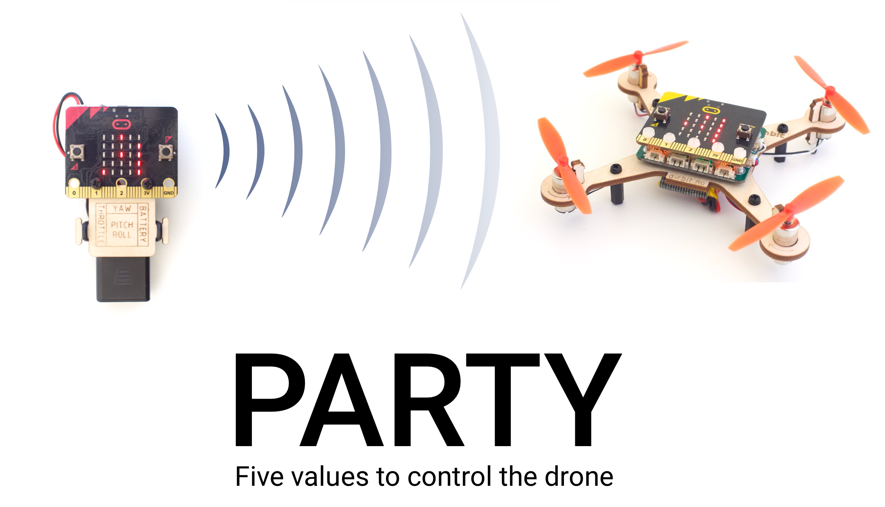

## AirBit Drone project

C/C++ code based on micro-tools framework: https://github.com/c272/micro-tools 
Documentation: https://microbit.c272.org

### Domains

- Hand controller: Defining control inputs and visualize on display
- AirBit Drone: Detect and fly based on input



PARTY: Pitch, arm, roll, throttle, yaw


### Setup
```console
./microinstall.sh
. aliases.sh
microinit src
microbuild BUILD_DIRECTORY=./src
```

or you can edit aliases.sh, such that you can use the microbuild command directly: 

```console
alias microbuild="/Users/geirolatvinnereim/AirBit/microbuild.sh BUILD_DIRECTORY=./src"
```

### Usage

- microinstall: fetching the lastest microbit v2 sdk into repository and building the source

- microbuild: Building the repository you call the command from into the sdk. Copying source files into sdk

- microflash: Making mnt folder with flashed output. NB! microbit must be connected.

- setup:
  
Feed in filepath to microbit-v2-sdk: /Users/geirolatvinnereim/AirBit/microbit-v2-sdk


### Troubleshooting

If nrf_sdh_soc_init() cannot be found. You have called build from a wrong folder. Chech microbit-v2-sdk/source and assure that only the src/.cpp files are present.

### Debugging

In order allow debugging, the project needs to be built by navigating into the microbit-v2-sdk and access debugger inside Visual Studio Code.

```console
python3 build.py
```

### Linter

We want to utilize a dynamic analysis tool, which can linter codebase, not a static one

Using **clang-format** as dynamic cpp-linter. install and usage:
This command line tool can only linter one file at a time, so we need to apply recursiveness
```console
brew install clang-format
find /Users/geirolatvinnereim/AirBit/src -iname '*.h' -o -iname '*.cpp' | xargs clang-format -i
```