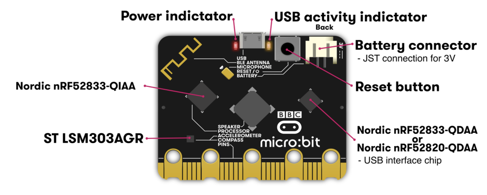

# MICROBIT V2 Documentation

The microbit hardware is really cool, hand has many different peripherals avaliable to be explored:


You can read more about the hardware [here](https://tech.microbit.org/hardware/)

##### Peripherals: 
- 5x5 led display to view state / debugging / testing
- 2x Buttons (A, B, A+B) + Reset button on the backside
- 5x Pins on edge connector (0, 1, 2, 3V, GND)
- TouchButton on logo
- Microphone (record sound)
- Speaker (reproduce sound)
- Radio antenna 2.4 GHz (transmitter and receiver based on channels)
- Micro USB input for flashing and communication
- Accelerometer, Gyroscope, Magnometer
- Compass
- Termometer
- Bluethooth

##### Processor and drivers
- Nordic nRF52833-QIAA processor
- ST LSM303AGR ADC, DAC, Compass, Accelerometer, Gyroscope
- Nordic nRF52833-QDAA USB interface, flash

The overview of the components:


##### Hardware block diagram


##### SDK
Peripherals are accessible through the SDK and abstracted through a [MicroBit class interface](../microbit-v2-sdk/libraries/codal-microbit-v2/model/MicroBit.h): 

```console
MicroBit uBit;
```


