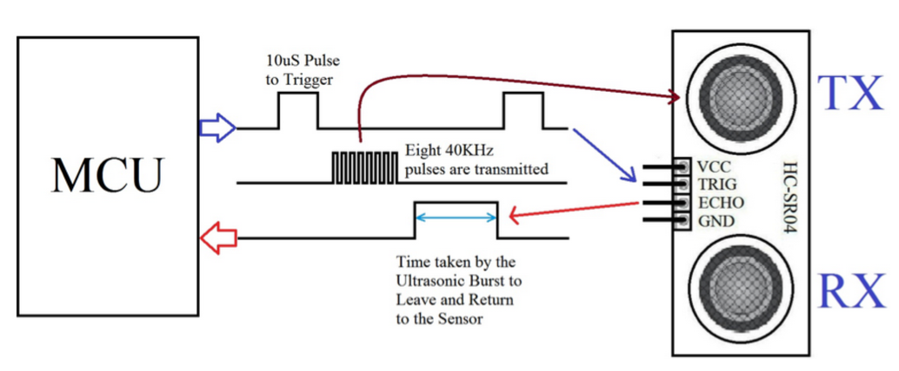

# Flight controller
Reimplement the javascript logic found [here](https://github.com/gomakekit/Airbit_V2/blob/master/custom.ts).

### Ultrasonic sensor (external hardware HC-SR04)

The microbit PCB is equiped with a barometer which can be used to calculate the altitude of the quadcopter. However, due to the properllers impacting the sounding pressure, this measurement is not reliable. To circumvent this problem, and retieving a reliable measurement, an external ultrasonic sensor can be connected to the microbit.

#### HC-SR04 stats
- [3.3, 5] Vdc
- Weight: 9g
- Range: 2cm - 400cm ± 3mm 

#### Principle 
1. Apply TRIG pulse of 10 $\mu$s to start the measurement.
2. The TRID sonar will putput an 8-cycled burst at 40KHz and raise the ECHO pin.
3. The time the ECHO signal is high is proportional to the distance measured, following the rule: 

$$ distance(cm) = \frac{pulse (\mu s)}{58}$$ 

