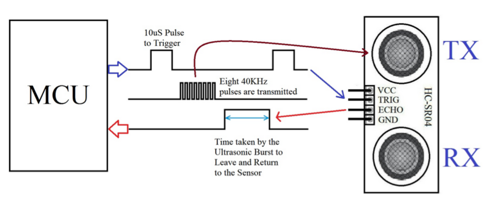
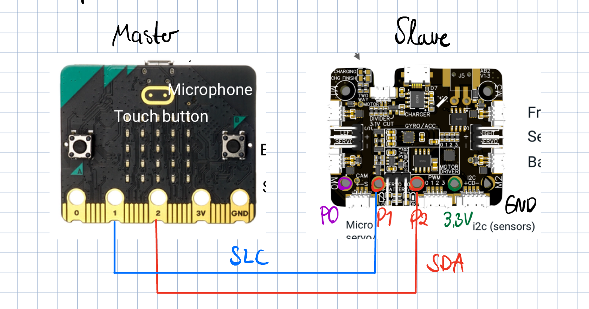
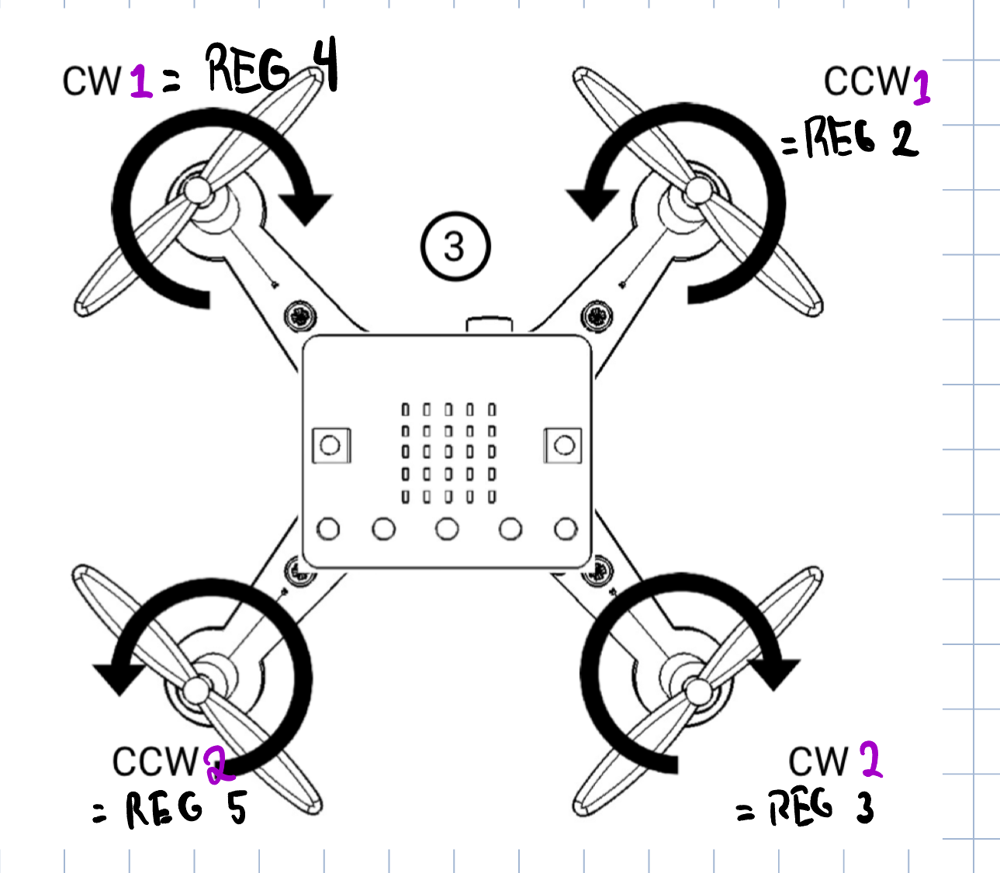

# Flight controller
Reimplement the javascript logic found [here](https://github.com/gomakekit/Airbit_V2/blob/master/custom.ts).

### Ultrasonic sensor (external hardware HC-SR04)

The microbit PCB is equiped with a barometer which can be used to calculate the altitude of the quadcopter. However, due to the properllers impacting the sounding pressure, this measurement is not reliable. To circumvent this problem, and retieving a reliable measurement, an external ultrasonic sensor can be connected to the microbit.

#### HC-SR04 stats
- [3.3, 5] Vdc
- Weight: 9g
- Range: 2cm - 400cm ± 3mm 

#### Principle 
1. Apply TRIG pulse of 10 $\mu$s to start the measurement.
2. The TRID sonar will putput an 8-cycled burst at 40KHz and raise the ECHO pin.
3. The time the ECHO signal is high is proportional to the distance measured, following the rule: 

$$ distance(cm) = \frac{pulse (\mu s)}{58}$$ 

### Battery logic

With the provided setup, the analog pin P0 is used to monitor charging and battery level. The battery millivoltage range from [3400, 4200] mV, describing respectively an empty 🪫 and full battery level 🔋. Based on this range, we define 5 different battery levels in the logic. The drone needs charging if battery level equals BatteryLevel::EMPTY or BatteryLevel::LOW. 

Reading from the Pin P0 is a noisy measurement so a logical lowpass filter is implemented

An charge plug icon is displayed when the battery needs charging, during the charging a battery icon is displayed.

### Servo Motor & IMU (WonderKit Black board)

In order to apply actuation to the system, the MicroBit v2 is connected to a ServoMotor via its pins. The I2C Protocol (Inter-Integrated Circuit) is implemented as communication layer between the two modules using P2 (SDA) and P1 (SCL). Based on this serial-connection the Microbit can read and write actuation to the propellers. By writing to the Servo Motor registers, the servo motor will apply a PWM signal to the properllers. 

The I2C functionality availiable in the sdk can be found [here](../../microbit-v2-sdk/libraries/codal-nrf52/source/NRF52I2C.cpp)

