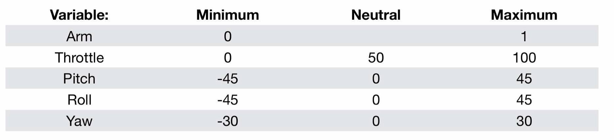
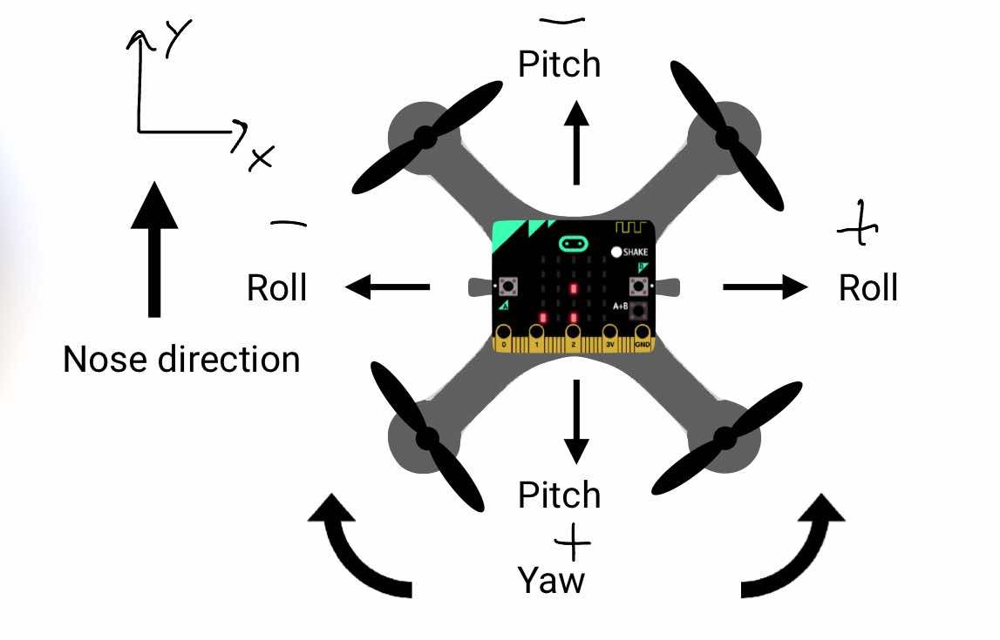
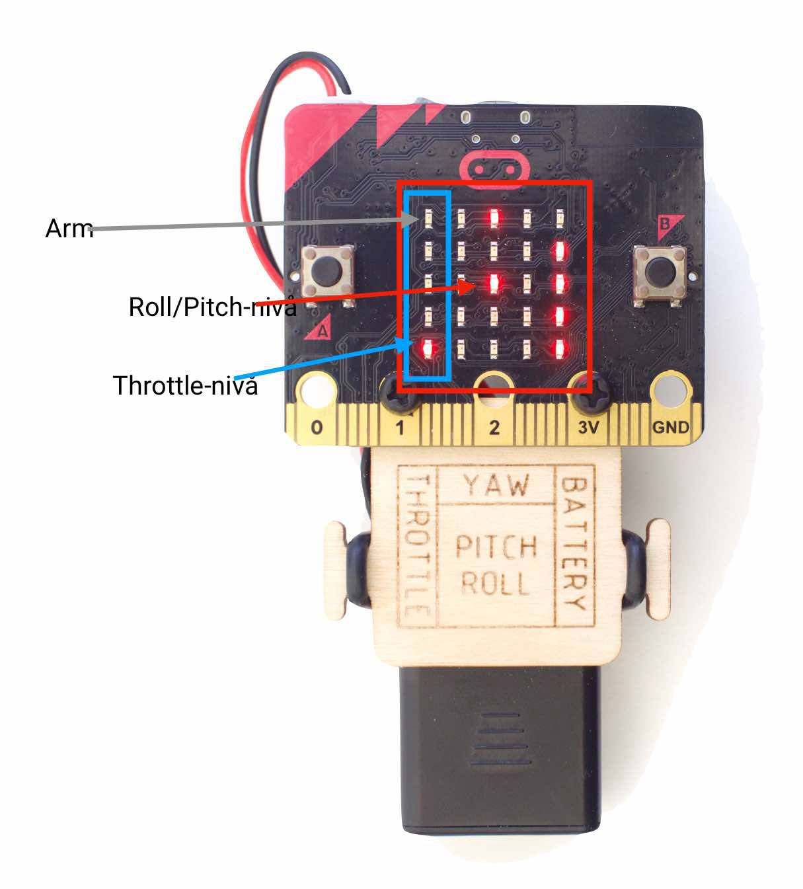

# Hand Controller Logic

### Control variables

The following table describes the different control variables and their operating range

all these variables are defined in the header file, and are connected to the **extern keyword** allowing them to be shared among other cpp modules.

```
extern int pitch;
extern bool armed;
extern int roll;
extern int throttle;
extern int yaw;
``` 




### Buttons - Throttle Control, Arm (buttons.cpp)

Implementation / Button clicks: 
- A+B: Arm / Disarm the controller. The controller starts to track control variables. 
- A: Throttle is incremented by 5. If the variable exeeds 40, it increments 1.
- B: Throttle is decremented by 5. Value can not become negative.


### Compass - Pitch / Roll Control (orientations.cpp)

Implementation: 
- The microbit has an IMU inbuilt which tracks the orientation of the device. 
- The codal lib provides methods on retrieving the pitch and roll using the accelerometer.

```
void Accelerometer::recalculatePitchRoll()
{
    double x = (double) sample.x;
    double y = (double) sample.y;
    double z = (double) sample.z;

    roll = atan2(x, -z);
    pitch = atan2(y, (x*sin(roll) - z*cos(roll)));
}
```

- The accelerometer bases its calculation on the SIMPLE CARTSESIAN coordinate space:

SIMPLE_CARTESIAN: Data will be returned based on an easy to understand alignment, consistent with the cartesian system taught in schools.

When held upright, facing the user:
```
                           /
    +--------------------+ z
    |                    |
    |       .....        |
    | *     .....      * |
 ^  |       .....        |
 |  |                    |
 y  +--------------------+  x-->
 ```

- A positive pitch is given when the controller is rotated counter-clock-wise around the x-axis
- A positive roll is given when the controller is rotated clock-wise around the y-axis
This is illustrated in the picture below:



### Visualisation (display.cpp)

A mapping of the control variables into a 5x5 LED display is implemented:
- Armed / disarmed can be found in the upper-left corner (0,0)
- The left-most column is used to visualize throttle.
- The rest of the matrix is used to describe the pitch / roll relation.

#### Throttle: 

If throttle is 0, do not turn on LED.
$$
y = \left\lfloor 4 - \frac{x}{25} \right\rfloor
$$
By applying a floor function to the linear scaling, we assure that throttle = 100 is the only value who gets LED panel position 0 (y = 0)

#### Pitch / Roll: 

Linear mapping is used to map the angles to display coordinate.
The angles, $x \in [-45, 45] \in \mathbb{R}$,
The display coordinates, $y \in [0, 4] \in \mathbb{I}$
$$
y = \frac{2}{45}(x + 45)
$$
By applying a floor function to the linear scaling, we assure that throttle = 100 is the only value who gets LED panel position 0 (y = 0)

#### Yaw: 

Linear mapping is used to map the angle to display coordinate.
The yaw value, $x \in {-30, 0, 30}$,
The display coordinates, $y \in [1, 3] \in \mathbb{I}$
$$
y = \frac{x}{30} + 2
$$




